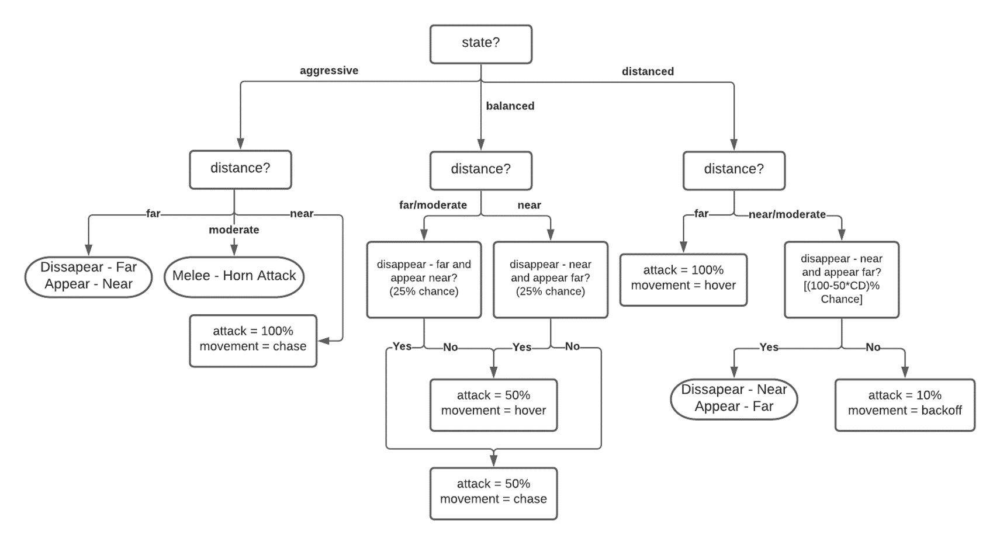

# Spirit-In-Me
Click [here](https://jt5519.github.io/Spirit-In-Me/) to play the game on a GitHub page created for this game.(The game textures have been scaled down to a maximum size of 256 to keep the game file under 100mb due to github limitation. So excuse the lower texture quality :)) 

# Game Details
* Survival/Action Horror
* Hyper realistic mechanics  
* A complex and challenging enemy AI 
* Exploration driven
* Complete story (20 - 25 minutes of story time)

# Enemy AI Behavior
The enemy AI behavior is implemented by a 2 layer behavior system. Layer 1 is the state (similar to emotional state in humans) layer and is less volatile and does not change moment to moment. Layer 2 is the behavior layer that controls the moment to moment actions of the AI, and this layer is influenced by layer 1. Before explaining how the layers work, the actions that the AI can commit are mentioned below under AI Mechanics:

## Enemy AI Mechanics
### MOVEMENT
* Chase: Chases the player to attack at close range
* Hover: Hover in position
* Back-off: Try to distance itself from the player

### ATTACKS
* Ranged Attack: Enemy shoots a projectile that can curve to a certain degree to hit the player
* Melee Attacks: A horn attack with moderate range, A close range melee attack, A special attack 

### DISAPPEARING
Demon can disappear and reappear as it sees fit to escape player and to carry out special attacks.

## Layer 1 - State Layer
* Three states: Aggressive, Balanced, Distanced
* Does not change moment to moment, changes with change in factors affecting it.

Hierarchical factors affecting enemy STATE: (if two factors are true together, the factor higher in the list decides the state)
* Low Health
* High Damage taken
* Player play-style
* High Health gap
* Balancing requirement
* Player state
* Random (every 30 seconds, less volatile)

Some factors have long term effects. For example if the high damage taken factor flag is set to true but the next moment it is set to false, the AI should not just forget that it had taken high damage just a moment ago. So while the 'factor' may become false, the 'effect' once set true, only becomes false after a decided time has passed. Consequently the state of the AI is what the effect demands it to be for that entire duration. 

## Layer 2 - Behavior Layer
* Changes moment to moment
* Influenced by layer 1 STATE, similar to emotions influencing behavior
 
*Click image for clarity  

CD - Consecutive Disappearances 

## Attack Selection Function
In the behavior tree, in most places an attack probability is defined. The attack selection function uses this probability to decide whether to attack or not, and if it does attack then what attack to commit. Each attack that can be commited for the given range (distance between AI and player), has equal probability, except the special attack that depends on number of times the player has evaded the AI. Its probability rises with the number of consecutive evades committed. 

* Parameter: Probability of attack
* Checks distance to eliminate attacks out of range
* Decides attacks based on probabilities assigned to each attack
* Special attack probability depends on consecutive evades 
* Special attack probability =  Min(consecutive evades * 14, 100)

That explains the enemy AI working in detail.

## Some other games by me
* [FPPPS - An FPS game](https://github.com/JT5519/First-FPS)
* [H.A.B.R.O.S.I.P - HyperActive Ball Rolls On a Seizure Inducing Platform](https://github.com/JT5519/Roller-Madness)
* [Solar System Model](https://github.com/JT5519/Solar-System)
