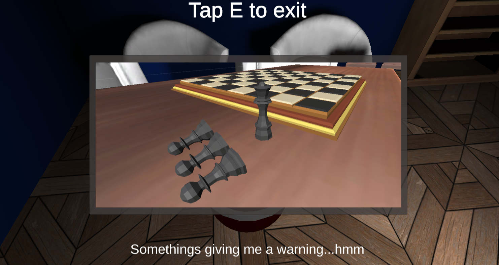
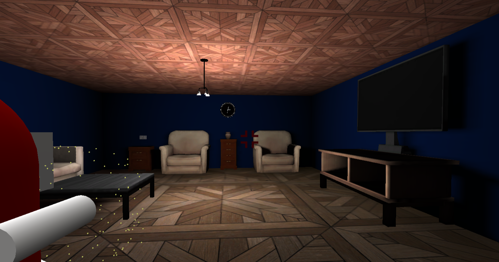

# Spirit-In-Me
Click [here](https://jt5519.github.io/Spirit-In-Me-Game/index.html) to play the game on a GitHub static page!

# Game Details
* Survival/Action Horror
* Hyper realistic mechanics  
* A complex and challenging enemy AI 
* Exploration driven
* Complete story (20 - 25 minutes of story time)

# Enemy AI Behavior
The enemy AI behavior is implemented by a 2 layer behavior system. Layer 1 is the state (similar to emotional state in humans) layer and is less volatile and does not change moment to moment. Layer 2 is the behavior layer that controls the moment to moment actions of the AI, and this layer is influenced by layer 1.

##Enemy AI Mechanics
###MOVEMENT
Chase: Chases the player to attack at close range
Hover: Hover in position
Back-off: Try to distance itself from the player

###ATTACKS
Ranged Attack: Enemy shoots a projectile that can curve to a certain degree to hit the player
Melee Attacks: A horn attack with moderate range, A close range melee attack, A special attack 

###DISAPPEARING:
Demon can disappear and reappear as it sees fit to escape player and to carry out special attacks.

## Some other games by me
* [FPPPS - An FPS game](https://github.com/JT5519/First-FPS)
* [H.A.B.R.O.S.I.P - HyperActive Ball Rolls On a Seizure Inducing Platform](https://github.com/JT5519/Roller-Madness)
* [Solar System Model](https://github.com/JT5519/Solar-System)
