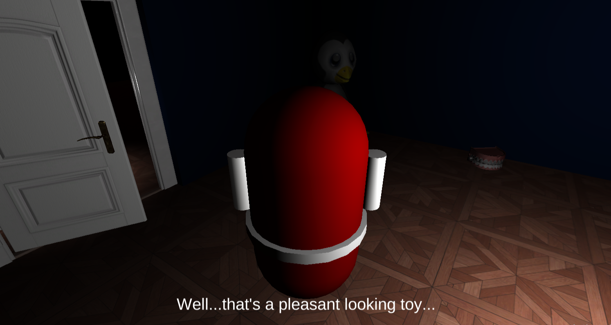

# Spirit-In-Me
Click [here](https://jt5519.github.io/Spirit-In-Me-Game/index.html) to play the game on a GitHub static page!

# Game Details
* Survival/Action Horror
* Hyper realistic mechanics  
* A complex and challenging enemy AI 
* Exploration driven
* Complete story (20 - 25 minutes of story time)

## Some other games by me
* [FPPPS - An FPS game](https://github.com/JT5519/First-FPS)
* [H.A.B.R.O.S.I.P - HyperActive Ball Rolls On a Seizure Inducing Platform](https://github.com/JT5519/Roller-Madness)
* [Solar System Model](https://github.com/JT5519/Solar-System)
