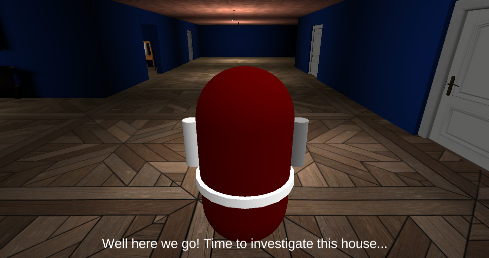

# Spirit-In-Me
Click [here](https://jt5519.github.io/Spirit-In-Me-Game/index.html) to play the game on a GitHub static page! Read below for an issue I faced while creating the page, would appreciate a better solution.  (Recomended screen resolution: 1920 x 1080) 

# Git LFS vs GitHub Static Page issue

The data.unityweb file for the game is 147 mb, hence it could not be uploaded to GitHub without Git LFS. Git LFS and GitHub static pages [do not work together](https://github.com/git-lfs/git-lfs/issues/3026).

Only solution I found is to reduce file size below 100 mb to make it playable on GitHub static pages.

The playable link above is a GitHub static page of a [separate repo](https://github.com/JT5519/Spirit-In-Me-Game) I made for the reduced size game. To play the original sized game, download the "Original Game" folder contents from this repo and run it on your browser like you would run a Unity WebGL file. 

# Difference between the original size game and reduced size game
* Lightmap size reduced from 1024 to 256
* Lightmap resolution reduced from 20 to 10 (reduced size quite a bit)
* Start Menu background music removed (a long track that was on loop)
* Car game object removed from the garage (high poly asset, advisable to remove such assets that are only for aesthetics)
* Toy truck from the play room were removed (another high poly asset)

# Game Details
* Survival/Action horror game
* Play as a hunter of supernatural entities that also has a special ability to leave their physical body as a spirit and beat the shit out of supernatural entities
* 20 minutes of story driven gameplay 
* A challenging enemy AI 
* Significant exploration and mystery components 
* Free roam 

## Some other games by me
* [FPPPS - An FPS game](https://github.com/JT5519/First-FPS)
* [H.A.B.R.O.S.I.P - HyperActive Ball Rolls On a Seizure Inducing Platform](https://github.com/JT5519/Roller-Madness)
* [Solar System Model](https://github.com/JT5519/Solar-System)
